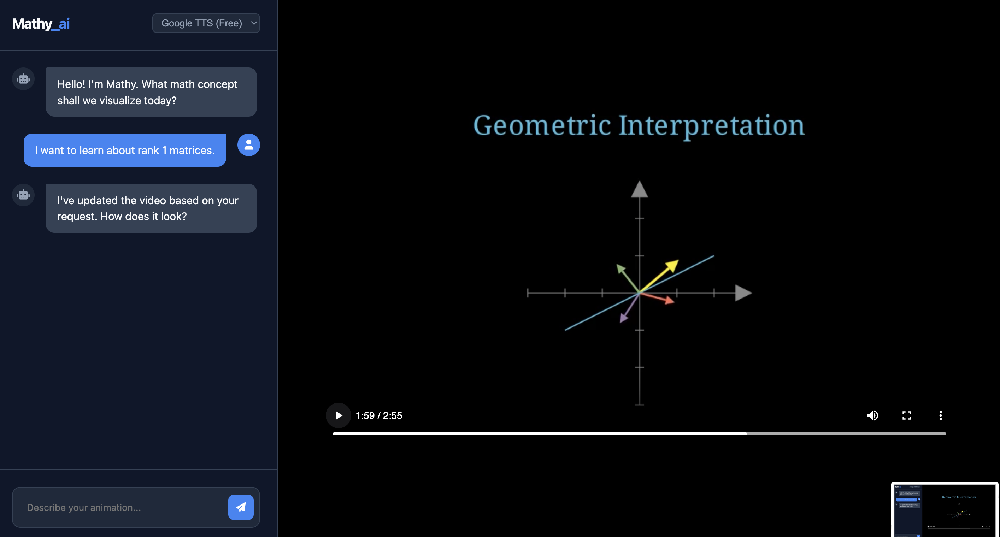

# Mathy.ai 🎬
A text-to-video AI generator for educational math content.
It generates videos in the style of 3blue1brown, explain any math or cs concepts with nice animations and voice over. You can either use Elevenlabs for natural sounding voice if you have api credits, otherwise google TTS can do the job  but it's a bit robotic. Or even without any voice.

The UI is a web app, lovable style, where you can chat with the AI to make and edit the video.



## Setup
1. **Keys**: Create a `.env` file with:
   ANTHROPIC_API_KEY=sk-...
   ELEVENLABS_API_KEY=sk-... (Optional)
2. **Install**:
   pip install -r requirements.txt
   docker build -t mathy-runner .
3. **Run**:
   uv run uvicorn app.main:app --reload
4. **Use**: Open http://localhost:8000

## Structure

```
mathy_ai/
├── app/                     # Backend Logic
│   ├── __init__.py
│   ├── main.py              # Server Entrypoint
│   ├── config.py            # Settings & Keys
│   ├── models.py            # Data Structures
│   └── services/
│       ├── __init__.py
│       ├── llm.py           # Claude AI Logic
│       └── manim.py         # Rendering Logic
├── frontend/                # Web Interface
│   ├── index.html
│   ├── style.css
│   └── script.js
├── media/                   # Video Output (Auto-created)
├── .env                     # API Keys (Create this file)
├── .gitignore               # Git rules
├── Dockerfile               # Manim Environment
├── requirements.txt         # Dependencies
└── README.md                # Instructions
```
